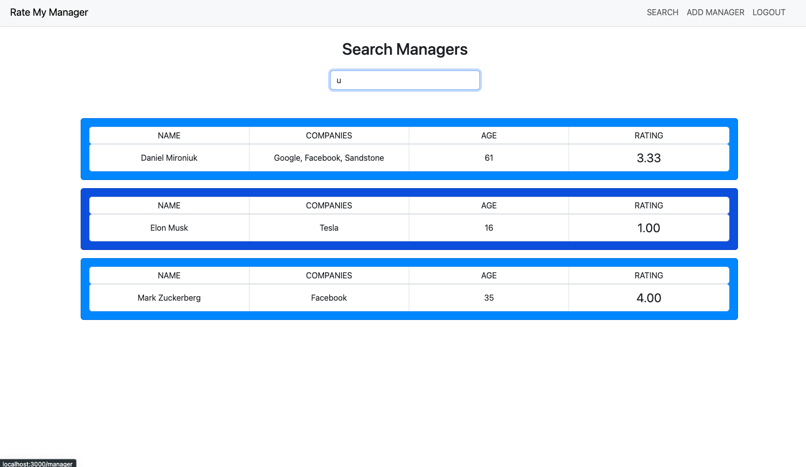

<a name="readme-top"></a>

[](https://GitHub.com/Naereen/StrapDown.js/graphs/commit-activity)


<!-- TABLE OF CONTENTS -->
<details>
  <summary>Table of Contents</summary>
  <ol>
    <li>
      <a href="#about-the-project">About The Project</a>
      <ul>
        <li><a href="#built-with">Built With</a></li>
      </ul>
    </li>
    <li>
      <a href="#getting-started">Getting Started</a>
      <ul>
        <li><a href="#prerequisites">Prerequisites</a></li>
      </ul>
    </li>
    <li><<a href="#installation">Installation</a></li>
  </ol>
</details>


<!-- ABOUT THE PROJECT -->
## Rate My Manager MERN Stack Project



This project is a MERN stack web application designed to reflect the behaviors of Rate My Professor but in the context of rating managers of companies that employees work for to convey their experience with a manager. This will mitigate the chance of toxic management and keep those individuals accountable. One can create new managers, rate them, view other ratings, have an user account with authentication/ hashing of passwords, and responsively search managers.

At Runtime: 
* Docker runs both web server containers (react and node).
* Routes to login page where the user logins and authenicates that login with JWT otherwise can route to the signin page.
* Once user has authenticated they can rate managers but first needs to search for them or create one.
* Click on a choice from the list of managers and click on the add rate button, fillout the form to create a new rating
* Can't rate the same manager more than once.

<p align="right">(<a href="#readme-top">back to top</a>)</p>


### Built With

Languages:
* Javascript
* CSS

Frameworks:
* React
* Express
* React-Bootstrap

Databases:
* MongoDB

Stacks:
* MERN

Platforms / Environments:
* Docker
* Node

Libraries:
* cors
* mongoose
* jsonwebtoken
* bcryptjs
* express-rate-limit
* dotenv


<p align="right">(<a href="#readme-top">back to top</a>)</p>


<!-- GETTING STARTED -->
## Getting Started

Make sure to have Docker installed with Docker Desktop and the ability to run `docker-compose` once you do you can move forware with the installation instructions.

### Installation

1. Clone the repo
  ```sh
  git clone https://github.com/dnnysoftware/GPS-Web-App.git
  ```
2. Make sure to have Docker installed 
  ```sh
  docker info
  ```
3. Sign up for MongoDB and create a new database in order to get your connections string!
4. In the `/server` folder create an `.env` file and put the following inside
    ```sh
    PORT = 5500

    ATLAS_CONNECTION_STRING = "YOUR MONGODB CONNECTION STRING"

    TOKEN_KEY = "PUT IN A RANDOM GENERATE TOKEN CAN BE ANY RANDOM STRING YOU WANT"
    ```
5. Run the docker-compose.yml file 
  ```sh
  docker-compose -f docker-compose.yml up
  ```
6. Open your browser and copy and paste `http://localhost:3000` and HAVE FUN!

<p align="right">(<a href="#readme-top">back to top</a>)</p>